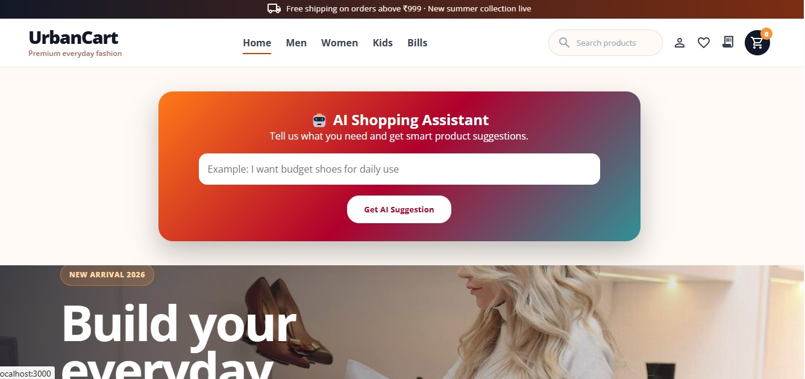
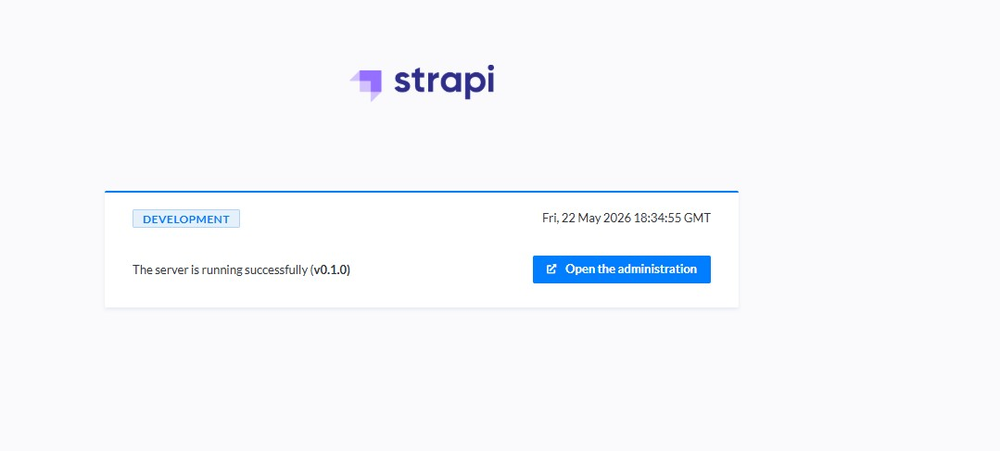
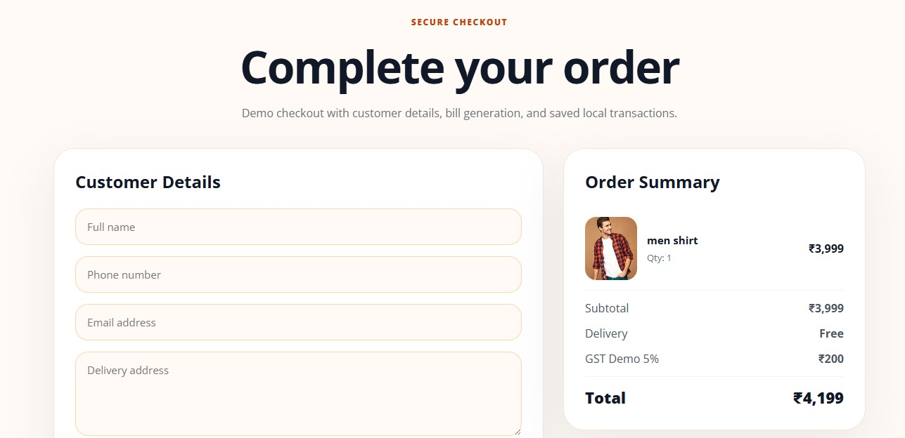

<# urbancart-ai-ecommerce

AI-powered full-stack e-commerce platform with React, Strapi, MySQL, smart shopping assistant, cart management, checkout flow, bill generation, order history, and responsive UI.
## Features

- User Signup/Login
- Admin Dashboard
- Course Management
- Buy Now Flow
- Customer Details Form
- Bill Generation
- Order History
- Responsive UI
- Demo Payment Integration

## Tech Stack

- React.js
- Spring Boot
- MySQL
- Razorpay
- CSS

# Screenshots

## 🤖 AI Shopping Assistant


## Homepage


## Admin Login


## Buy Now


## Customer Details


## Stripe Payment


## Run Frontend

```bash
cd client
npm install
npm start
```

## Run Backend

```bash
cd api
npm install
npm run develop
```